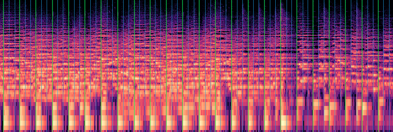

<p align="center">
  
</p>

[](https://luczeng.github.io/musicality/)

A Python library for music analysis via SOTA methods using ML, bayesian inference and signal processing. Built using PyTorch, PyTorch Lightning, and Hydra — with desktop and mobile apps for building homemade training data.  

Currently supports:  

- Tempo estimation
- Beat estimation
- Tempo phase estimation

<details id="setup">
<summary><b>Setup</b></summary>

```bash
uv sync
uv pip install -e .
```

### quick install

For quick setup on a remote instance, a conveniance script is provided: 

```bash
bash tools/setup_remote.sh
```

This also fetches custom dataset from the remote via DVC (currently on Infomaniak s3). Requirements are to setup env variables `AWS_ACCESS_KEY_ID`, `AWS_SECRET_ACCESS_KEY`, and `WANDB_API_KEY`. The custom datasets might become available on demand.


</details>

<details id="datasets">
<summary><b>Datasets</b></summary>

Training data comes from two sources, both read identically by every loader/tool in
this repo:

- **mirdata datasets** — publicly available beat/tempo-annotated datasets (ballroom,
  brid, hainsworth, rwc_classical, rwc_jazz, rwc_popular, groove_midi, guitarset),
  fetched via [mirdata](https://mirdata.readthedocs.io).
- **Homemade datasets** — audio recorded and beat-tapped by hand with the annotation
  apps below (e.g. a `swing` dataset of hand-recorded dance tracks). These live under
  `data/<name>/tracks/` (audio) and `data/<name>/annotations/*.beats` (tapped beats),
  a plain directory layout rather than a mirdata dataset definition.

### Data format

**mirdata datasets** are read entirely through
[mirdata](https://mirdata.readthedocs.io)'s own API and on-disk layout —
`TempoDataset`/`BeatDataset` never touch the files directly, just
`track.audio_path`, `track.tempo`, `track.beats.times`, and
`track.beats.positions` (1-indexed bar/count position per beat, when the
dataset annotates it).

**Homemade datasets** (recorded via the annotation apps) use a parallel,
hand-rolled layout under `data/<dataset>/`, centralized in
`musicality.dataformats` (`musicality/dataformats/dataformat.yaml`) rather
than scattered as string literals across the annotator code:

```
data/<dataset>/tracks/<track_id>.wav                          # audio
data/<dataset>/annotations/<track_id>.beats                   # beat annotations (default annotator slot)
data/<dataset>/annotations/<track_id>.meta.json                # descriptive metadata (default annotator slot)
data/<dataset>/annotations/<annotator_id>/<track_id>.beats     # a second annotator's take on the same track
data/<dataset>/annotations/<annotator_id>/<track_id>.meta.json
```

`.beats` files use the same `<time> <position>` per-line format as mirdata's
own raw beat annotations (e.g. ballroom's), so homemade and mirdata tracks
read identically once loaded — one line per beat, seconds then 1-indexed
bar/count position:

```
10.949773 1
11.247052 2
11.653333 3
```

`.meta.json` carries fields mirdata has no place for — all optional, filled in
incrementally as an annotation is worked on, and forward-compatible (a file
missing a newer field just falls back to that field's default on load):

| Field | Meaning |
|---|---|
| `location` | Where the track was recorded/found |
| `device` | Recording device (e.g. phone model, hostname) |
| `structure` | Free-text song structure notes |
| `duration_s` | Audio duration, in seconds |
| `bpm_mean` / `bpm_median` / `bpm_std` | Tempo statistics derived from the tapped beats |
| `annotator_id` | Who made this annotation — `null` for the original/default slot |
| `section_aligned` | Whether the first tapped beat is the true start of a section (`true`/`false`), or `null` if not recorded |
| `schema_version` | Metadata schema version (currently `2`) |

Multiple people can annotate the same track independently: `annotator_id: null`
is the original, unsuffixed slot (every file saved before multi-annotator
support existed still resolves here — no migration needed), and each named
annotator gets their own subdirectory holding a parallel `.beats`/`.meta.json`
pair for the same `track_id`. Not yet used to feed training — `BeatDataset`/
`TempoDataset` still read exclusively through mirdata; bridging homemade
annotations into training is separate future work.

### Splits

Train/val splits are precomputed and stored as plain index lists under
`data/splits/<name>/{train,val}.txt`, read by `Splitter.run()` at train/eval time.
It never generates a split itself — if `data/splits/<name>/` is missing, training
crashes with `FileNotFoundError` rather than silently creating a new (and possibly
different) one. That's what makes a split reproducible across machines: version the
files under `data/splits/` (e.g. via DVC, same as the audio) and pull them rather than
regenerating locally, where a different `mirdata` version or an incomplete download
could silently produce a different split.

#### Create a split

```bash
uv run python tools/create_splits.py                          # every dataset in data/
uv run python tools/create_splits.py --datasets ballroom brid  # just these
uv run python tools/create_splits.py --val-split 0.15 --force  # custom split, overwrite
```

Creates two splits per dataset: a tempo split (`data/splits/<name>`, from
`TempoDataset`) and a beat-phase split (`data/splits/beat_phase-<name>`, from
`BeatDataset`). Whichever has no samples for a given dataset (e.g. no tempo
annotations) is skipped. Existing splits are left untouched unless `--force` is passed.

#### Binary-meter-only beat-phase splits

Some datasets mix meters — ballroom's waltz/Viennese waltz tracks are annotated with a
triple-meter bar-position cycle (`1, 2, 3, 1, 2, 3, ...`) instead of the binary meter
(beats-per-bar a multiple of 2, e.g. `1, 2, 3, 4, ...`) the beat-phase `one`/`last`
targets assume. Pass `--binary-only` to drop those tracks — and any track with no
position annotation at all, since its meter can't be confirmed — when building the
beat-phase split:

```bash
uv run python tools/create_splits.py --datasets ballroom --binary-only
```

This saves to a separate `data/splits/beat_phase-<name>-binary` split, since it's a
different-length dataset than the unfiltered one. Training/eval must set the matching
flag so they load the split that actually corresponds to the dataset they build:

```bash
uv run python tools/train_beat.py binary_only=true
uv run python tools/eval_beat.py --checkpoint <path> --dataset ballroom --binary-only
```

#### Version splits with DVC

```bash
uv run dvc add data/splits
git add data/splits.dvc data/.gitignore
git commit -m "Version train/val splits"
uv run dvc push
```

On another machine, `dvc pull` (see [Fresh machine](#fresh-machine--remote-instance-eg-vastai)
above) fetches the exact same split files, so training and evaluation line up across
machines instead of each generating its own split locally.

</details>

<details id="annotation-apps">
<summary><b>Annotation apps</b></summary>

Two apps produce homemade datasets — audio plus hand-tapped beat annotations, saved
in the same format the mirdata datasets use.

### Desktop annotator

`tools/annotator/` — a PySide6 GUI for browsing datasets, tapping beat annotations by
ear, and recording new tracks from a microphone.

- Waveform display with beat markers and a playback cursor; click to seek,
  Ctrl+click to add a beat, Ctrl+right-click to remove one
- Tap-tempo widget and metronome for annotating a track by ear, with a configurable
  count (4/8) and accent pattern
- Audible click track synced to the annotated beats, with its own volume control
- Record new tracks straight from the microphone into a named dataset folder
- Run inference with a trained beat-phase checkpoint and preview the model's
  predicted beats on a second waveform strip above the track, with an optional click
  track against the prediction instead of the manual annotation
- Per-track metadata (recording device, location, structure) plus a dataset browser
  showing per-track annotation status

```bash
uv run python -m tools.annotator --dataset ballroom
uv run python -m tools.annotator --dataset ballroom --track Media-105901
```

### Mobile companion

`tools/mobile_companion/` — an offline-first PWA + FastAPI backend for recording
audio and tapping tempo from a phone, syncing captures into the same
`data/<dataset>/tracks/` + `annotations/*.beats` structure the desktop annotator
reads. Useful for field recordings (e.g. live dancing) away from a laptop. See
`tools/mobile_companion/README.md` for setup, including remote HTTPS access via
Tailscale.

</details>

<details id="train">
<summary><b>Training</b></summary>

### Tempo estimation

`musicality/models/tcn.py` (`TCNTempoNet`) is the default backbone, wrapped by
`musicality/trainers/tempo_module.py` (`TempoModule`) — see the
[API documentation](#api-documentation) for architecture, loss modes, and metrics.
Alternate backbones: `musicality/models/tempo_net.py` (a simpler CNN),
`musicality/models/huggingface.py` (wraps HuggingFace `transformers` models, e.g.
wav2vec2/BEaT), `musicality/models/torch_audio.py` (wraps pretrained `torchaudio`
models).

Training is configured with [Hydra](https://hydra.cc) and overridable on the
command line; every key in `configs/train.yaml` is documented in place — see the
[configuration reference](https://luczeng.github.io/musicality/configuration.html)
for the full file.

```bash
uv run python tools/train.py
```

Override any value on the command line:

```bash
# Change batch size and learning rate
uv run python tools/train.py batch_size=16 lr=3e-4

# Train for more epochs on GPU
uv run python tools/train.py trainer.max_epochs=200 trainer.accelerator=gpu

# Use a different model config
uv run python tools/train.py model=cnn n_mels=64
```

Hydra writes logs and run configs to `outputs/<date>/<time>/` by default.
Checkpoints are saved to `checkpoint_dir` (top-3 by `val/loss`, with early stopping
after 10 epochs without improvement).

### Beat-phase detection

A second pipeline, alongside tempo estimation, detects frame-level **beat** /
**"one"** (downbeat) / **"last"** (last beat of the group — bar position 4 by
default) events. It reuses the same dataset/training scaffolding as tempo
estimation (`BeatDataset`, Hydra config, Lightning). Configured through
`configs/beat_train.yaml`, every key documented in place — see the
[configuration reference](https://luczeng.github.io/musicality/configuration.html)
for the full file.

```bash
uv run python tools/train_beat.py

# quick smoke test — a couple epochs on a fraction of the data
WANDB_MODE=offline uv run python tools/train_beat.py \
    trainer.max_epochs=2 train_subsample=0.2 checkpoint_dir=checkpoints_beat_test/

# a phrase-position (1-8) dataset instead of the default bar-position (1-4) one
uv run python tools/train_beat.py group_size=8 data.name=<phrase_dataset>
```

### Sweep learning rates

`tools/sweep_lr.py` batch-trains across a list of learning rates (reusing the
same dataloaders and seed across runs, so lr is the only thing that varies)
and prints a comparison table of best validation metrics.

```bash
uv run python tools/sweep_lr.py --lrs 1e-4 5e-4 1e-3

# save the comparison table instead of only printing it (.csv or plain text)
uv run python tools/sweep_lr.py --lrs 1e-4 5e-4 1e-3 --output sweep_results.csv
```

</details>

<details id="leaderboard">
<summary><b>Leaderboard</b></summary>


| Dataset | Task | Split | Beat F-measure |
|---|---|---|---|
| ballroom (binary meter) | Beat detection (beat-only) | val, 104 tracks | 0.896 |


</details>

<details id="tools">
<summary><b>Tools</b></summary>

| Tool | Description |
|---|---|
| `tools/train.py` | Hydra entry point for training a tempo model |
| `tools/train_beat.py` | Hydra entry point for training a beat-phase model |
| `tools/create_splits.py` | Create the train/val splits under `data/splits/` that `Splitter.run()` requires (see [Splits](#splits)) |
| `tools/eval_beat.py` | Evaluate a beat-only or beat-phase checkpoint (task auto-detected) on full-length tracks (not the fixed-duration training clips): beat F-measure, plus "1"/"last" F-measure and phase-confusion rate for beat-phase checkpoints |
| `tools/sweep_beat_postprocess.py` | Grid-search postprocessing thresholds (`beat_threshold`/`min_distance_frames`/`gate_tolerance`) for a beat-only checkpoint, scoring each combination by mean beat F-measure |
| `tools/sweep_lr.py` | Batch-train the beat-phase model over a list of learning rates and compare results |
| `tools/plot_beat_targets.py` | Visualize a `BeatDataset` clip's waveform against its smeared beat/one/last targets |
| `tools/download_dataset.py` | Download datasets listed in `configs/download.yaml` via mirdata |
| `tools/summarize_datasets.py` | Print summary statistics (song count, annotation types) for all downloaded datasets |
| `tools/inspect_track.py` | Print metadata and annotations for a single audio file |
| `tools/plot_tempo_histograms.py` | Plot BPM distributions across datasets |

See [Annotation apps](#annotation-apps) above for `tools/annotator/` and
`tools/mobile_companion/`.

```bash
uv run python tools/train.py
uv run python tools/train_beat.py
uv run python tools/create_splits.py
uv run python tools/eval_beat.py --checkpoint <path-to-ckpt> --dataset ballroom
uv run python tools/sweep_beat_postprocess.py --checkpoint <path-to-ckpt> --dataset ballroom
uv run python tools/sweep_lr.py --lrs 1e-4 5e-4 1e-3
uv run python tools/plot_beat_targets.py --dataset ballroom
uv run python tools/download_dataset.py
uv run python tools/summarize_datasets.py
uv run python tools/inspect_track.py path/to/audio.wav
uv run python tools/plot_tempo_histograms.py
```

</details>

<details id="api-documentation">
<summary><b>API documentation</b></summary>

Sphinx-generated API reference for the `musicality` package — losses, metrics,
loaders, models, trainers, callbacks — with math equations rendered for the loss
functions. Docstrings are the source of truth; the docs are built from them, not
maintained separately.

```bash
uv run sphinx-build -b html docs/source docs/build && open docs/build/index.html
```

While editing docstrings, use the live-reload server instead — it rebuilds and
refreshes the browser on save:

```bash
uv run sphinx-autobuild docs/source docs/build
```

Rendering the math equations requires internet access (MathJax loads from a CDN);
everything else works fully offline.

</details>
